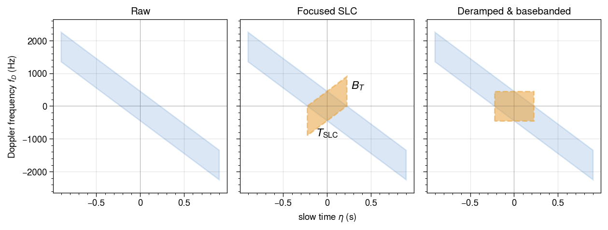
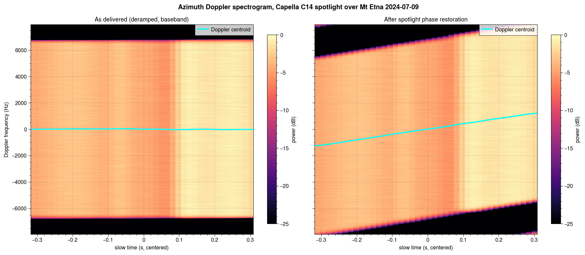

# Spotlight Phase Restoration

This page explains the necessary steps to perform InSAR processing on Capella's spotlight, zero-Doppler processed single-look complex (SLC) images.
We have provided a script `restore_spotlight_phase.py` to demonstrate, as well as a full pair-processing example as `coregister_spotlight.py`.

## Time frequency diagram of spotlight data

SAR acquisitions collected in spotlight mode steer the antenna beam in azimuth to track the scene center. The increased dwell time improves azimuth resolution. The beam rotation produces a linear Doppler variation across the received signal, sweeping the instantaneous Doppler frequency from positive Doppler (forward looking) to negative Doppler (backward looking) as azimuth (slow) time progresses.



The Capella processor applies a deramping and basebanding step during focusing. The deramp multiplies the signal by a complex exponential whose instantaneous frequency cancels the linear Doppler ramp so the delivered SLC has its azimuth spectrum centered at zero.

## Model of deramping and basebanding function

The deramping step is a pixel-wise multiplication by a complex exponential that depends on geometric position. The SLC phase $\phi$, before deramping, depends on the two-way propagation phase between the radar antenna and the target scatterer, $\phi = \frac{-4 \pi}{\lambda} \cdot R $, where $\lambda$ is the radar wavelength.

The Capella metadata includes two metadata items to describe the deramping function: a *Reference Antenna Position*, $A_0$, and *Reference Target Position*, $P_0$. For each ground target point $P$, the phase $\phi_P$ that was removed during processing can be written

$$
\begin{align}
\phi_P &= -\frac{4\pi}{\lambda} \bigl(R - R_0\bigr) \\
&= -\frac{4\pi}{\lambda} \Bigl(\bigl|A_0 - P\bigr| - \bigl|A_0 - P_0\bigr|\Bigr)
\end{align}
$$

where $P$ is the ECEF position of each pixel, $R = |A_0 - P|$ is the slant range to each pixel, and $R_0 = |A_0 - P_0|$ is the scalar "reference distance" (the slant range distance from the reference antenna to the reference position). Since $\phi_P$ was applied at each pixel by the Capella SAR processor, this phase can be restored to the SLC  by multiplying each complex pixel in the deramped SLC $x_{\text{deramped}}$ by the complex conjugate:

$$
x_{\text{restored}} = x_{\text{deramped}} \cdot e^{-i \phi_P}
$$

The two reference positions are annotated in the SLC metadata  within the "image" subfield as `reference_antenna_position` and `reference_target_position`.  The `P` values for each pixel are the ECEF coordinates of the scene, which can be computed by converting the latitude, longitude, and height of each pixel to ECEF.

## Example script

A sample Python script is provided to compute the phase correction:

```bash
# Auto-downloads a Copernicus DEM over the SLC footprint
python docs/examples/restore_spotlight_phase.py CAPELLA_SPOTLIGHT_SLC.tif

# Or provide your own DEM in EPSG:4326
python docs/examples/restore_spotlight_phase.py CAPELLA_SPOTLIGHT_SLC.tif \
    --dem-file my_dem.tif \
    --output-dir restore_out \
    --output SPOTLIGHT_restored.tif
```

After restoration the SLC can be fed into a normal InSAR coregistration pipeline such as `coregister_isce3.py`.

`restore_spotlight_phase.py` executes three steps:

1. (optional) Obtain a DEM: if `--dem-file` is omitted, a Copernicus DEM covering the SLC footprint (plus a small buffer) is downloaded via the [Sardem](https://github.com/scottstanie/sardem) library.
2. Compute the pixel-wise image geometry (using, for example, `isce3.geometry.Rdr2Geo`) of the SLC's radar coordinates, producing per-pixel lon / lat / height rasters.
3. Phase re-ramping: open the SLC and the geometry VRT, and for each pixel,
   - read `lon`, `lat`, `height`, and the complex SLC tile
   - convert to ECEF target positions (`llh_to_ecef_wgs84`);
   - compute `φ_P` with `compute_restoration_phase`;
   - multiply by `exp(-1j · φ_P)` and write the corrected tile.

The figure below shows the azimuth Doppler spectrogram of a Capella C14 spotlight SLC over Mt Etna, before and after the re-reramping procedure. The original SLC's spectrum (left) sits at baseband with no linear frequency increase, while restoration (right) puts the Doppler centroid back on its original linear track.



## References

Capella Space SAR Products Format Specification v1.8 - definitions of `reference_antenna_position` and `reference_target_position`.
